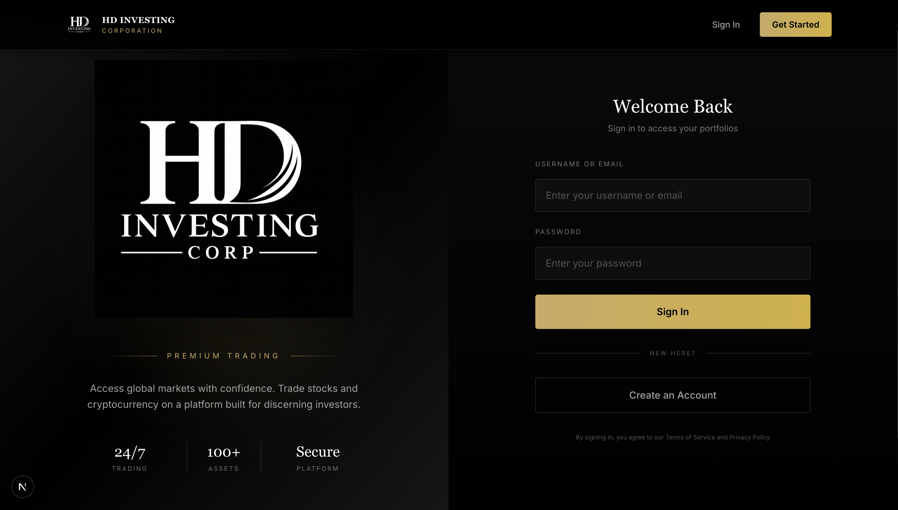
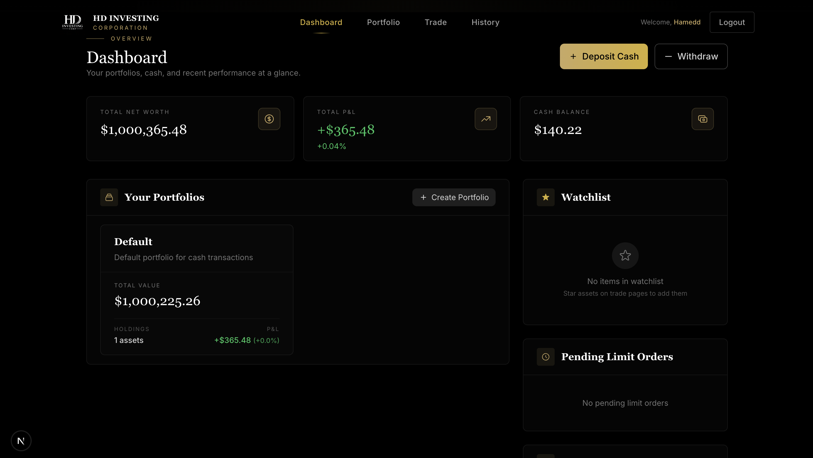
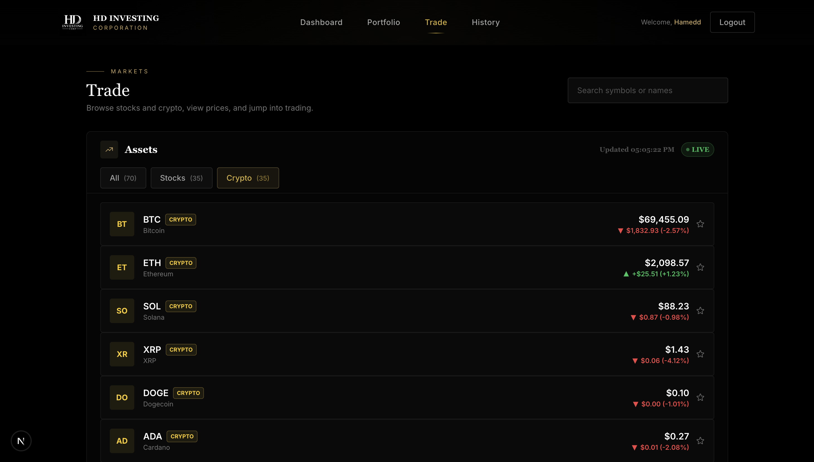
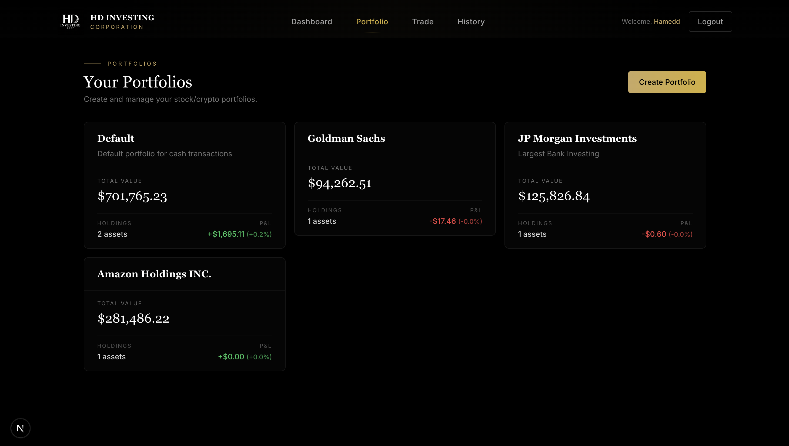
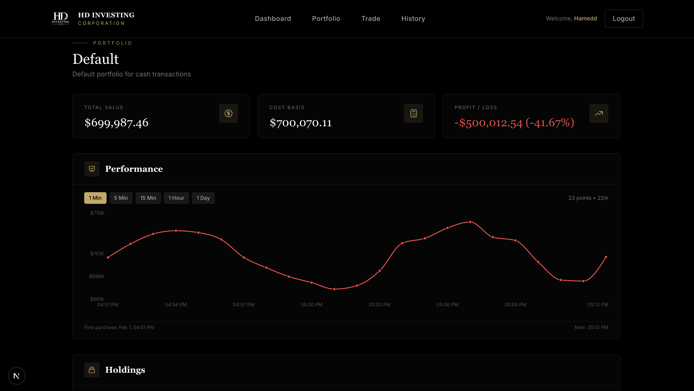
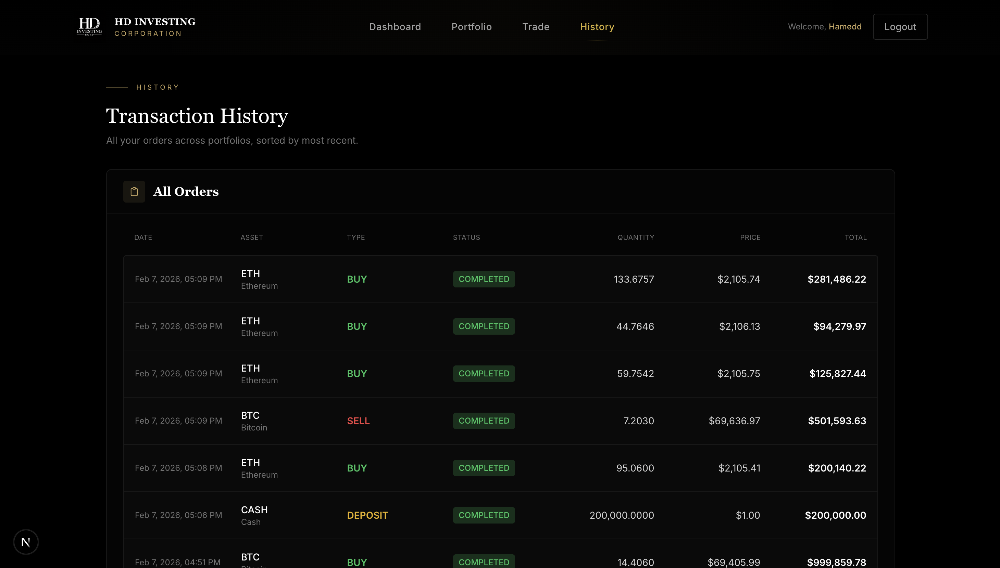

<div align="center">

# HD Investing Corporation

### A Premium Hybrid Stock & Cryptocurrency Trading Platform

[](https://openjdk.org/)
[](https://spring.io/projects/spring-boot)
[](https://nextjs.org/)
[](https://www.typescriptlang.org/)
[](https://www.postgresql.org/)
[](https://redis.io/)
[](https://tailwindcss.com/)
[](https://docker.com/)
[](https://jwt.io/)

[Screenshots](#-screenshots) · [Tech Stack](#-tech-stack) · [Getting Started](#-getting-started) · [API Integrations](#-api-integrations)

</div>

---

## Overview

**HD Investing Corporation** is a full-stack trading platform that unifies stock and cryptocurrency markets into a single, elegant interface. Users can create multiple portfolios, execute market/limit/stop-loss orders, track real-time prices, monitor performance with interactive charts, and manage a personal watchlist, all wrapped in a premium dark UI with gold accents.

Built as a production-grade monorepo with a **Spring Boot** REST API backend and a **Next.js** frontend, the platform integrates live market data from **Polygon.io** (stocks) and **Coinbase Exchange** (crypto), with **Redis**-powered caching and **PostgreSQL** persistence.

---

## Screenshots

### Landing Page

A sleek, branded entry point that sets the tone for the platform experience.


**Features on this page:**
- Premium black and gold branding with HD Investing Corporation logo
- "Trade with Confidence" hero section with platform introduction
- Sign In and Get Started navigation buttons
- Responsive layout optimized for first impressions

---

### Authentication



**Features on this page:**
- JWT-based sign in with username or email and password
- New user registration with "Create an Account" flow
- Branded split-screen layout with logo and platform visuals
- Platform stats at a glance: 24/7 Trading, 100+ Assets, Secure Platform
- Terms of Service and Privacy Policy acknowledgement

---

### Dashboard



**Features on this page:**
- **Total Net Worth** summary card with real-time valuation
- **Total P&L** card showing profit/loss amount and percentage
- **Cash Balance** card displaying available funds for trading
- **Deposit Cash** and **Withdraw** buttons for instant fund management
- **Your Portfolios** section with cards showing each portfolio's total value, holdings count, and P&L
- **Create Portfolio** button to add new portfolios
- **Watchlist** widget showing starred assets (synced server-side across sessions)
- **Pending Limit Orders** widget showing active limit orders waiting to execute

---

### Markets / Trade Page



**Features on this page:**
- Browse all available stocks and cryptocurrencies in a unified list
- **Tab filters** for All, Stocks, and Crypto with asset counts
- **Search bar** to find assets by symbol or name
- Live prices with 24h change amount and percentage (color-coded green/red)
- **LIVE indicator** with last-updated timestamp
- **Watchlist star** on each row to add/remove from your personal watchlist
- Click any asset to open the detailed trading view with chart and order form

---

### Portfolio Management



**Features on this page:**
- Create and manage **multiple portfolios** with custom names and descriptions
- Each portfolio card displays total value, number of holdings, and real-time P&L
- Separate portfolios for different strategies (e.g. Default, Goldman Sachs, JP Morgan Investments, Amazon Holdings)
- **Create Portfolio** button with gold accent styling
- Portfolio-level P&L tracking with green (profit) and red (loss) indicators

---

### Portfolio Performance



**Features on this page:**
- **Total Value**, **Cost Basis**, and **Profit / Loss** summary cards at the top
- **Interactive performance line chart** powered by Recharts
- Configurable time intervals: 1 Min, 5 Min, 15 Min, 1 Hour, 1 Day
- Data point count and time range displayed on the chart
- **Holdings section** below the chart with per-asset breakdown (quantity, average buy price, current value)
- First purchase date and current timestamp shown for time context

---

### Transaction History



**Features on this page:**
- Complete audit trail of every order across all portfolios
- Sortable table with columns: Date, Asset, Type, Status, Quantity, Price, Total
- Color-coded order types: green for **BUY**, red for **SELL**, yellow for **DEPOSIT**
- **COMPLETED** status badges on each executed order
- Shows asset name and symbol for each transaction
- Price per unit and total order value for full transparency
- Covers all order types: market buys, sells, and cash deposits

---

## Tech Stack

### Backend

| Technology | Purpose |
|:--|:--|
|  | Language runtime |
|  | REST API framework |
|  | JWT authentication and authorization |
|  | Relational database |
|  | Price caching, JWT blacklist, rate limiting |
|  | ORM and repository layer |
|  | Build and dependency management |

### Frontend

| Technology | Purpose |
|:--|:--|
|  | React framework with App Router |
|  | Type-safe development |
|  | Utility-first styling |
|  | Server state and data fetching |
|  | Client state management |
|  | Interactive performance charts |
|  | HTTP client with JWT interceptor |

### Infrastructure

| Technology | Purpose |
|:--|:--|
|  | PostgreSQL + Redis containers |
|  | Stock market data API |
|  | Cryptocurrency price API |

---

## Getting Started

### Prerequisites

- **Java 17+** and **Maven 3.8+**
- **Node.js 18+** and **npm**
- **Docker and Docker Compose** (for PostgreSQL and Redis)

### 1. Start Infrastructure

```bash
docker-compose up -d
# PostgreSQL on port 5432, Redis on port 6379
```

### 2. Configure Environment

Create `exchange-backend/.env`:

```env
POLYGON_API_KEY=your_polygon_api_key
FINNHUB_API_KEY=your_finnhub_api_key
```

> Polygon.io free tier provides 5 API calls/minute. Sign up at [polygon.io](https://polygon.io/) to get a key.
> Crypto prices use the public Coinbase Exchange API with no key required.

### 3. Start Backend

```bash
cd exchange-backend
mvn clean install
mvn spring-boot:run
# API running at http://localhost:8080
```

### 4. Start Frontend

```bash
cd exchange-frontend
npm install
npm run dev
# App running at http://localhost:3000
```

---

## API Integrations

| Provider | Data | Tier |
|:--|:--|:--|
| **Polygon.io** | Stock quotes (previous day close), historical OHLCV bars | Free (5 req/min, 15-min delayed) |
| **Coinbase Exchange** | Live crypto prices, 24h stats, historical candles | Public (no key required) |

Prices are cached in Redis with a 5-minute TTL to minimize external API calls and ensure fast response times across the platform.

---

## Project Structure

```
hybrid_exchange/
├── exchange-backend/          # Spring Boot REST API
│   ├── src/main/java/com/exchange/
│   │   ├── config/            # Security, Redis, CORS, WebClient, data seeding
│   │   ├── controller/        # REST endpoints (auth, assets, orders, prices, portfolios)
│   │   ├── dto/               # Request/response DTOs
│   │   ├── entity/            # JPA entities (User, Asset, Portfolio, Order, Holding)
│   │   ├── exception/         # Global error handling
│   │   ├── repository/        # Spring Data JPA repositories
│   │   ├── security/          # JWT filter, token provider, user principal
│   │   └── service/           # Business logic (orders, pricing, portfolios)
│   └── src/main/resources/
│       └── application.yml    # App configuration
│
├── exchange-frontend/         # Next.js 16 App
│   ├── src/app/               # App Router pages (dashboard, trade, portfolio, history)
│   ├── src/components/        # Reusable UI (OrderForm, PriceChart, WatchlistStar)
│   ├── src/hooks/             # Custom hooks (useAuth, useAssets, usePrices, usePortfolio)
│   ├── src/lib/               # API client, utilities, confetti
│   └── src/types/             # TypeScript type definitions
│
├── docker-compose.yml         # PostgreSQL + Redis
└── screenshots/               # Application screenshots
```

---

<div align="center">

### Built by [Hamed Dawoudzai](https://github.com/HamedDawoudzai)

**[Back to Top](#hd-investing-corporation)**

</div>
